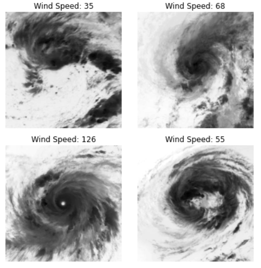
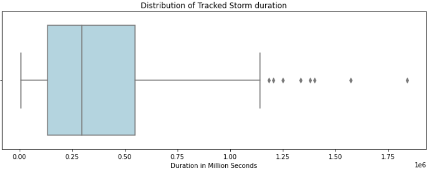
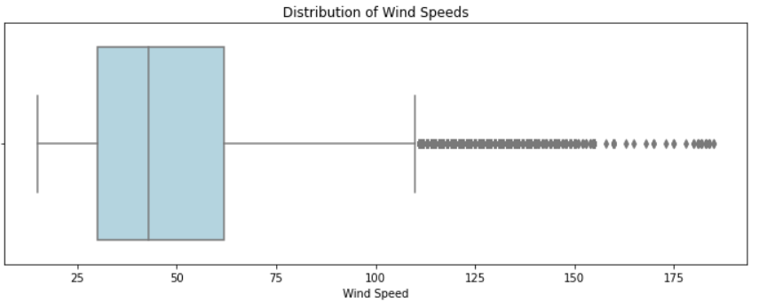
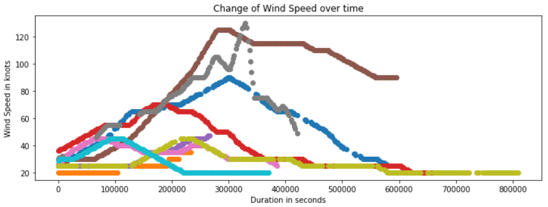
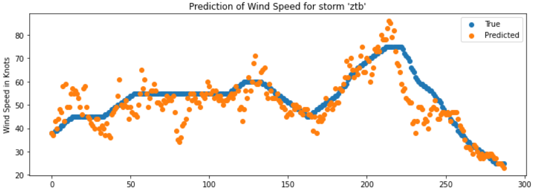
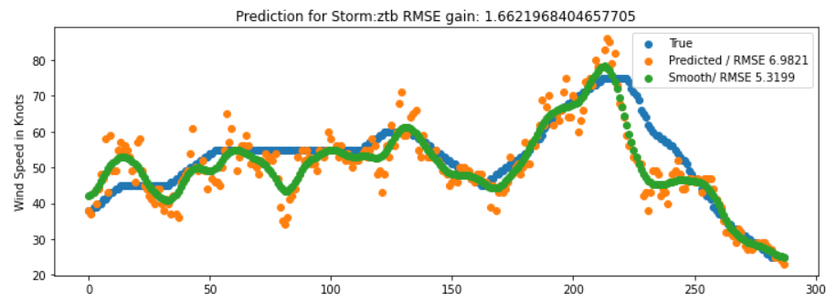

The [Driven Data Wind Prediction](https://www.drivendata.org/competitions/72/predict-wind-speeds/){:target="_blank"} was assembled by the nonprofit organization [Radient Earth Foundation](https://www.radiant.earth/){:target="_blank"} and hosted by Driven Data. The Radient Earth Foundation aims to "apply machine learning for Earth observation to meet the Sustainable Development Goals". In order to gain more practical experience in this field, I decided to participate in this competition. Even though I agree that there are numerous shortcomings to competitons like these, mainly that it skips many essential real world tasks like data aquisition and cleaning, defining objectives etc., I still believe they are valuable to improve your skills and get exposed to different data and tasks. The following blog post is supposed to outline my approach to the challenge as well as difficulties and learning successes I encountered along the way.

## Problem Description
The aim of this challenge is to predict the wind speed of tropical storms based on satellite images. For this purpose images from 494 different storms were collected for a total of 70,257 training and 44,377 test images, each of size 366x366 pixels. The ultimate goal is to develop a diagnostic model that can be of help preparing for disaster and subsequent responses. It should be noted, however, that in this competition the objective is to only predict the wind speed at the current time step or image and not make inferences on future wind speeds given current data.

## Software
Since this is an image processing task that lends itself to the use of Convolutional Neural Networks (CNN), I was looking for a platform to utilize GPUs and decided to use Google Colab Notebooks. The first difficulty I encountered was being able to use the image data in the network environment, because it would take way too long to upload the data to Google Drive and mount it to the Colab Notebook. However, it is possible to download data directly into the notebook environment from a tar file, with the only downside that this download process has to be repeated every time the notebook is re-opened the next time. This did not take much time, however, and hence I found it a reasonable approach for GPU access. The project was done in PyTorch and the full notebook can be found [here](https://colab.research.google.com/drive/16BjOLiwUEAzbgr3DytnlBjryfkDP9oGb?usp=sharing){:target="_blank"} (Running the full notebook yields a submission file that achieves a 10.10 RMSE score on the test set).

## Data Description and Exploration
As previously mentioned, the training dataset consists of around 70,000 images. Additionally, each image has a storm id, a relative time (how long after the initial tracking start was this image recorded) and an ocean variable (in which of two oceans did the tropical storm occur). This means that there is a temporal component in the dataset that could be of value for modelling but also demands attention for careful splitting the dataset into training and validation because one should not leak information from the future to the present. This means that we cannot use information from future data in a storm's development to infer the current wind speed. In this manner, all test set data temporaly succeeds training data. To get an idea of the storm images, take a look at some examples below.

We can observe that with increasing wind speeds a more clear eye in the center begins to form. Additionally, most of the unique features seem to occure around the image center.

With respect to the other features in the data, I will highlight a couple of plots. First, we can ask what the average duration of a storm is. The mean duration comes out to be around 370,000 seconds (100 hours), with a high standard deviation of 298,000 seconds (80 hours). The boxplot below also shows that the distribution is positively skewed. 

Next, the target variable wind speed. The average wind speed is 50 with a high standard deviation of 26. Similarly to above, the distribution is positively skewed with a long tail. The maximum speed is 185, while the minimum is only 15. 

Lastly, to get an idea of how the wind speed changes for storms over time, we sample 10 different storms from the dataset and plot their wind speed over time. The result is captured in the following image.

We can see that there are a variety of patterns that occur. Storms reach their peak wind speed at different time steps, and some storms never have wind speeds higher than the average. Furthermore, the rate of change also differs significantly. Some storms seem to change in a "mellow" way, while the gray example shows more sudden changes.  

## Data Processing
The only processing step for the feature data was to normalize the time column with mean normalization. With respect to the images, I choose a center cropped to 128x128 pixels, since I believed that the most interesting features are located in the center and the smaller image size would also allow for faster training. A common approach for image data is to introduce data augmentations to increase the varieties of images and avoid overfitting. Initiatlly, I included the standard horizontal and vertical flip augmentations, however, after inspecting the images, I realized that in this case those augmentations do not make a lot of sense. From my understanding these images come from hurricanes, which means they occur in the northern hemisphere. This is important because, as I found out, all hurricanes in the northern hemisphere spin in a counter clockwise direction. The flipping would change this property and hence create hurrican images that are impossible.

## Model Architecture
My idea was to use a pretrained ResNet model from PyTorch. These models have been pretrained on the famous [ImageNet](http://www.image-net.org/about-overview){:target="_blank"} dataset with millions of images. However, the ImageNet dataset includes real-world photos, while this dataset includes images of different structure. Hence, it is desireable to keep the early layers of the pretrained model that identify more basic features like edges but retrain or fine tune later layers so the network can identify features more unique to the storm images. Additionally, the final fully connected layer has to change from a classification to a regression task, so we only have a single scalar output. Initially, I was unsure what the best approach would be to modify the trainable parameters in the network but came across [this post](https://stackoverflow.com/questions/47206714/which-layers-should-i-freeze-for-fine-tuning-a-resnet-model-on-keras){:target="_blank"} which I found tremendously helpful. It suggests to leave out the 4th layer (turn it into an Identity) and only leave the 3rd layer trainable. During experiments I tried ResNet 50, 101, and 152 with this approach but found that ResNet 50 worked the best. The final linear layer consisted of a dropout layer, followed by a linear layer, an ELU activation layer and a final linear output layer. I used the popular Adam optimizer and by definition of the competition, the loss function was root mean squared error (RMSE). 

## Model Training 
I realized that training neural networks in the "real-world" is very different from course assignments in university where approaches and hyper parameters are already defined and tests or benchmarks show whether or not you are on the correct path. However, I found Andrey Karpathy's [blogpost](https://karpathy.github.io/2019/04/25/recipe/){:target="_blank"} that discusses practical tips tremendously helpful and highly recommend it.

One of the starting tips by Karpathy is to overfit a model and then adjust the model with regularization methods for better generalization. In this project I found that this seemingly easy task was not so straight forward, as even the pretrained ResNet 50 would not overfit. This is without any data augmentation or dropout. Only with a large ResNet 152 did some overfitting occur. The second thing I found surprising is that a large learning rate of 0.01, or 0.001 was needed to make decent training progress in a reasonable amount of time. After some initial experiments with different model sizes and learning rates I trained a ResNet 50 for several epochs, and then trained some more with a Step Learning Rate Scheduler. This improved the performance on the validation set considerably and I reached an RMSE of below 10 for the first time (baseline set by the competion is 12.69).

## Prediction Analysis and Model Averaging
When analyzing the predictions of my model on the validation set, their distribution seemed reasonable compared to the training set. However, when plotting some storms, I found that the variance in the CNN predictions was fairly large. For images with the same wind speed the CNN would sometimes predict values much higher and sometimes much lower as the plot below shows.

From the data exploration phase where the wind speed of a storm was plotted over time, it was clear that generally storms develop fairly smoothly without the rapid changes observed in the plot above. Since I was out of ideas on improving the CNN model, I thought that the final prediction result could improve if these predictions were smoothed out. For this purpose I filtered predictions per storm id and then used a 1D gaussian filter to smooth predictions. And indeed, as the plot below demonstrates for our example, the RMSE score improved with this smoothing operation. When applying this operation on test set submissions to the competiton site, I generally observed an improvement by 0.8-1 RMSE points compared to predictions without smoothing.

One common approach in competitions like these is to train multiple models and average their predictions, which usually leads to an overall better result. In my case I finetuned three different ResNet 50 models, averaged and smoothed the predictions, which lead to my best score of 8.23 and place 26 out of 700 on the [leaderboard](https://www.drivendata.org/competitions/72/predict-wind-speeds/leaderboard/){:target="_blank"}.

## Takeaways
In the following paragraph I list several ideas that I played with but ended up not using because they didn't work as well as things I learned from this project.
My main shortcoming in this project was not being able to use the temporal information in a meaningful way. One idea I thought about was first using a CNN as a feature extractor to make a prediction for each image and then combine this information with the other features (time and ocean) as input to a second model which could utilize the sequential information. I wrote a Dataloader for this task and tried a Long-Short Term Memory (LSTM) model but with no success. There seems to be to great of variability between relative time and wind speed as one of the initial data exploration plots also showed.
Nevertheless, I gained valuable experiences in using a cloud service to run experiments with a decent size dataset of more than 100,000 images, writing custom PyTorch Dataloaders, fine-tuning pretrained models and analyzing prediction results.
Another weakness of my approach is that it is a standard CNN that only provides point estimates without a measure of uncertainty. In events like hurricanes it would be desirable to also obtain a measure of uncertainty. Bayesian methods provide this ability and a future project I would find interesting is to apply [Bayesian CNNs](https://arxiv.org/pdf/1901.02731v1.pdf){:target="_blank"} to this problem and compare the results. 

## Conclusion 
Overall it was a great learning experience to participate. In my best result, I used an ensemble of finetuned ResNet 50 models, as well as the gaussian smoothing trick. Besides the worthwhile coding experience, the competition also showed me that each step in the development pipeline should be carefully thought through to not make mistakes and to not loose time that could have been spent otherwise. I certainly plan on participating in further competitions by Driven Data.
